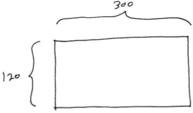
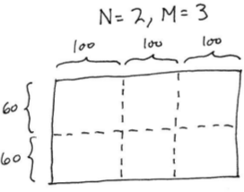

**Milestone 1**: Due Friday, Feb 8th by 11:59 PM

**Milestone 2**:

* In-person demo by Monday, Feb 25th
* Due Friday, Mar 15th by 11:59 PM

# Conway's Game of Life

Your task is to implement sequential and parallel programs to simulate [Conway's Game of Life](http://en.wikipedia.org/wiki/Conway's_Game_of_Life).

## Getting started

Download [CS365\_Assign02.zip](CS365_Assign02.zip) on the cluster head node and unzip it.

Copy the files **grid.h** and **grid.c** from your implementation of Assignment 1 into the **CS365\_Assign02** directory.

## The rules

In Conway's game of life, each cell value in the next generation is computed based on how many neighbors the cell had in the previous generation, and whether or not the cell was alive in the previous generation.

If a cell is alive in the current generation, it will be alive in the next generation if and only if it has either 2 or 3 neighbors in the current generation.

If a cell is dead in the current generation, it will be alive in the next generation if any only if it has exactly 3 neighbors in the current generation.

## life.h, life.c

The header and source files **life.h** and **life.c** define several functions that can be used in an implementation (sequential or parallel) of Conway's game of life.

Here are the function prototypes as defined in **life.h**. The commend for each function describes how it should work:

```c
//
// Load the game board from given file handle.
// The file consists of a series of integers.
// The first two integers specify the number of rows
// and columns, respectively.
// The remaining integers specify cell values (either 0 or 1)
// for all of the cells on the game board, in row-major order.
//
// The Grid returned by the function should have the contents of
// the file as the current generation.
//
Grid *life_load_board(FILE *fp);

//
// In given Grid, compute the next generation based on the
// current generation.
//
void life_compute_next_gen(Grid *grid);

//
// Save the contents of the current generation of the given Grid
// by writing them to the given file handle.
// The file format should be the same as the one expected
// by life_load_board().
//
void life_save_board(FILE *fp, Grid *grid);
```

The **life\_compute\_next\_gen** function implements one time step of the simulation: based on the values of the cells in the current generation, the cells in the next generation are computed, following the rules of the game.

The **life\_load\_board** and **life\_save\_board** functions load a game board from a file and write a game board to a file, respectively.

You will need to provide implementations of these functions in **life.c**.

Note: **life\_load\_board** and **life\_save\_board** can use **fscanf** and **fprintf** to read from and write to the file handles (**FILE** pointer values) passed to the functions.

## Milestone 1: Sequential computation

The source file **life\_seq.c** contains a **main** function implementing a sequential simulation of Conway's Game of Life.

The program takes two command line arguments:

-   *filename*, which is a file specifying the initial generation of cells
-   *numgens*, which is an integer specifying how many generations should be simulated

The code in **life\_seq.c** implements the computation by calling the functions you implemented in **life.c**. You may modify this code if you want to, but you will probably not need to.

### Testing the sequential version

The file **testin.dat** contains an data file with an initial configuration of a grid of 5 rows and 10 columns. The initial configuration is a [glider](http://en.wikipedia.org/wiki/Glider_(Conway's_Life)).

Here is a transcript showing the expected output when running the sequential program on this input file (user commands in **bold**):

<pre>
[dhovemey@cscluster]$ <b>./life_seq testin.dat 0</b>
5 10
0 0 1 0 0 0 0 0 0 0
0 0 0 1 0 0 0 0 0 0
0 1 1 1 0 0 0 0 0 0
0 0 0 0 0 0 0 0 0 0
0 0 0 0 0 0 0 0 0 0
[dhovemey@cscluster]$ <b>./life_seq testin.dat 1</b>
5 10
0 0 0 0 0 0 0 0 0 0
0 1 0 1 0 0 0 0 0 0
0 0 1 1 0 0 0 0 0 0
0 0 1 0 0 0 0 0 0 0
0 0 0 0 0 0 0 0 0 0
[dhovemey@cscluster]$ <b>./life_seq testin.dat 2</b>
5 10
0 0 0 0 0 0 0 0 0 0
0 0 0 1 0 0 0 0 0 0
0 1 0 1 0 0 0 0 0 0
0 0 1 1 0 0 0 0 0 0
0 0 0 0 0 0 0 0 0 0
[dhovemey@cscluster]$ <b>./life_seq testin.dat 3</b>
5 10
0 0 0 0 0 0 0 0 0 0
0 0 1 0 0 0 0 0 0 0
0 0 0 1 1 0 0 0 0 0
0 0 1 1 0 0 0 0 0 0
0 0 0 0 0 0 0 0 0 0
[dhovemey@cscluster]$ <b>./life_seq testin.dat 4</b>
5 10
0 0 0 0 0 0 0 0 0 0
0 0 0 1 0 0 0 0 0 0
0 0 0 0 1 0 0 0 0 0
0 0 1 1 1 0 0 0 0 0
0 0 0 0 0 0 0 0 0 0
</pre>

Make sure your sequential implementation produces similar output.

You can run the 20x20 tests (described in the "Testing the parallel version" section below) on your sequential implementation using the following commands:

    wget https://ycpcs.github.io/cs365-spring2019/assign/runtests.zip
    wget https://ycpcs.github.io/cs365-spring2019/assign/runtests_seq.sh
    unzip runtests.zip
    chmod a+x runtests_seq.sh
    ./runtests_seq.sh

## Milestone 2: Parallel computation

Your parallel version should use MPI to parallelize the computation. The source **life\_par.c** contains the **main** function of the parallel version. It receives four command-line arguments, *filename*, *numgens*, *N*, and *M*. The first two, *filename* and *numgens*, have the same meaning as in the sequential version. *N* and *M* specify how the computation should be parallelized: the overall game grid should be subdivided into *N* rows and *M* columns of smaller grids.

For example, let's say the overall game grid has 120 rows and 300 columns, and that *N* = 2 and *M* = 3. Here is the overall game grid:

> 

Here is how the game grid would be subdivided into 2 rows and 3 columns of smaller grids:

> 

The computation within each smaller grid will be handled by a separate parallel process.

The **runpar** script can be used to run the program. It takes the four arguments (*filename*, *numgens*, *N*, and *M*) indicated earlier. So, for example, the command

    ./runpar testin.dat 10 2 3

would run the simulation with the initial configuration specified by **testin.dat**, for 10 generations, dividing the overall game grid into 2 rows and 3 columns of smaller grids.

### Parallel implementaton hints

Each processor should create a grid for just its local computation, with one row/column of padding on each side for cells whose values will be computed by other processes.

You may find it useful to add a **grid\_set\_current** function to your grid datatype.

*Develop incrementally*. For example:

-   First, get each process to do its local computation without any communication
-   Start the communication by having processes exchange a single value (for example, each process with a left neighbor sends its upper-left cell, then each process with a right neighbor receives that value)
-   If exchanges of a single value work, change to receiving an entire column or row
-   Once one communication (e.g., send left/receive right) is working, add another

Once the program is working well (but not before!), you can consider making the communication more efficient. For example, rather than looping over each value in a row or column and sending it individually, send all of the values using a single send. (Note: you can define a derived datatype to send values in a column.)

## Testing the parallel version

### Small (20x20) test

Here is an automated test you can run.  From your `CS365_Assign02` directory, run the following commands:

    wget http://ycpcs.github.io/cs365-spring2019/assign/runtests.zip
    unzip runtests.zip

Then, run `make`.  To test the parallel version of your program, run the command

    ./runtests.sh

If all goes well, the output should look like:

    Running parallel version...
      1 generations...
      2 generations...
      3 generations...
      4 generations...
      5 generations...
      6 generations...
      7 generations...
      8 generations...
      9 generations...
      10 generations...
      11 generations...
      12 generations...
      13 generations...
      14 generations...
      15 generations...
      16 generations...
      17 generations...
      18 generations...
      19 generations...
      20 generations...
    done
    Comparing with sequential output...
    1 generations:
    2 generations:
    3 generations:
    4 generations:
    5 generations:
    6 generations:
    7 generations:
    8 generations:
    9 generations:
    10 generations:
    11 generations:
    12 generations:
    13 generations:
    14 generations:
    15 generations:
    16 generations:
    17 generations:
    18 generations:
    19 generations:
    20 generations:
    No failures...parallel output looks good!

### Large (1200x1200) test

Run the following command:

    wget http://ycpcs.github.io/cs365-spring2019/assign/hugetest.zip

Run `make` to make sure your code is compiled.  Then run the following commands:

    ./runpar huge.dat 400 8 7 > actual400.out
    diff actual400.out par400.out

If the `diff` command produces no output, then your parallel program produced the same output as mine on the input `huge.dat` after 400 generations of simulation.

# Grading criteria

Milestone 1:

-   Allocate grid: 10%
-   Read file, initialize first generation: 20%
-   Compute next generation, flip buffers: 40%
-   Iterate for specified number of generations: 20%
-   Output of final state: 10%

Milestone 2:

-   Milestone 1 features: 10%
-   Dividing work between processes: 25%
-   Local computation: 25%
-   Communication: 30%
-   Efficiency of communication: 10%

# Submitting

Run the command **make submit\_ms1** to submit Milestone 1, and the command **make submit\_ms2** to submit Milestone 2. Enter your Marmoset username and password when prompted.

**Important**: After submitting your work, log into the Marmoset server (<https://cs.ycp.edu/marmoset>) and check your submitted code to make sure it is what you intended to submit.  *It is your responsibility to ensure that your work is submitted correctly.*
