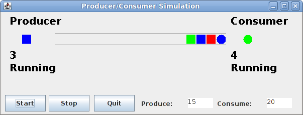

Getting Started
===============

Start by downloading [CS365\_Lab10.zip](CS365_Lab10.zip).

There are two options for working on this lab: on your own laptop using Eclipse, or on the cluster.

**Option 1 (your own laptop)**:  Import `CS365_Lab10.zip` into your Eclipse workspace. You should see a project called **CS365\_Lab10**.

**Option 2 (on the cluster)**: Unzip `CS365_Lab10.zip`.  Change directory to `CS365_Lab10` that is created by unzipping the file.  Execute the following command in your terminal:

```bash
export PATH=/usr/local/bin:$PATH
```

Open the Java source files in the project using any text editor.  When you need to compile the code, run the following command in the terminal:

```bash
gradle build
```

When you are ready to run the simulation, execute the following command:

```bash
./run.sh
```

Your Task
=========

Complete the implementation of the **MyQueue&lt;E&gt;** class. This class implements a bounded queue. The **enqueue** operation must wait if the queue is full, and the **dequeue** operation must wait if the queue is empty.

Interfacing with the simulation
-------------------------------

The **getContents** method is a special method used only by the simulation: it fills a **List** passed as a parameter with the items that are currently in the queue.

Also: when the **enqueue** and **dequeue** methods determine that it is necessary to wait for a condition to become true, they should surround the call to **wait** with calls to **producerWaiting()/producerRunning()** and **consumerWaiting()/consumerRunning()**, respectively, on the **observer** object. These calls allow the simulation GUI to keep track of when the producer and consumer are waiting. For example, if the **dequeue** method needs to wait for the queue to become non-empty:


observer.consumerWaiting();
lock.wait();
observer.consumerRunning();


Running
=======

When you are ready to test your bounded queue, run the **SimulationFrame** as a Java application.

The GUI looks like this:

> 

You can change the Produce and Consume times to increase the likelihood that the producer and consumer will be forced to wait. For example, if the produce time is less than the consume time, then the queue should tend to fill up, causing the producer to wait.

Hints
=====

The **lock** field is a reference to an object that you can use as a monitor. Make sure that all accesses to shared data are made while the lock is held! The body of each public method that accesses shared data should be a **synchronized** block. The **enqueue**, **dequeue**, and **getContents** methods will all need to be synchronized in this way.

The **data** field is a **LinkedList** object that you can use to store the items in the queue. The **removeFirst** and **addLast** methods will be useful for the **dequeue** and **enqueue** operations.

The **maxItems** field in **MyQueue** determines the maximum number of items that may be stored in the queue.

Don't forget to call **notifyAll** when a method enables a condition that another thread might be waiting for.
