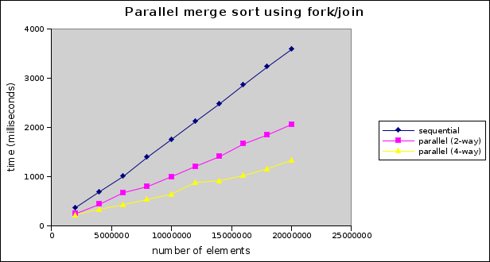
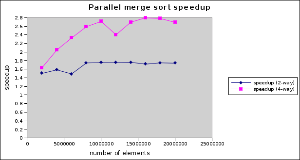
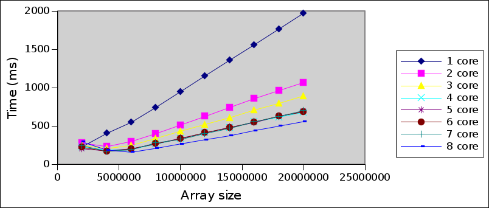

Example code for this lecture: [ForkJoin.zip](ForkJoin.zip)

Fork/join parallelism
=====================

*Fork/join parallelism* is a style of parallel programming useful for exploiting the parallelism inherent in *divide and conquer* algorithms on shared memory multiprocessors.

The idea is quite simple: a larger task can be divided into smaller tasks whose solutions can then be combined. As long as the smaller tasks are independent, they can be executed in parallel.

Example: finding the maximum value in a large array of integers. Each task is given three data:

-   **array** to search
-   **start** and **end** indices to search

The computation starts with the creation of a "root task", which represents the overall problem.


rootTask = new Task(arr, 0, arr.length)


Assume that task class has a **compute** method which searches the specified range. The compute method will check to see how many elements are in the range it needs to search. If the number of elements in the range is below a threshold value, then a sequential computation is performed. Otherwise, the range is split into two sub-ranges containing half of the elements. Subtasks are created to search the sub-ranges. The maximum of the maximum values in the subranges is the maximum value in the overall range.

Pseudocode for the compute method:


// returns maximum integer in range
int compute() {
    if ((end - start) <= THRESHOLD) {
        return result of sequential search for maximum element in range
    }

    // find middle index in range
    int mid = start + (end - start) / 2

    // create subtasks
    left = new Task(array, start, mid)
    right = new Task(array, mid, end)

    // start parallel tasks
    left.fork()
    right.fork()

    // wait for parallel tasks to complete, and get their results
    int leftMax = left.join()
    int rightMax = right.join()

    // max of sub-ranges is max of overall range
    return maximum of leftMax, rightMax
}


Notice that task objects are a lot like threads!

Choosing a threshold
--------------------

One of the main things to consider when implementing an algorithm using fork/join parallelism is chosing the threshold which determines whether a task will execute a sequential computation rather than forking parallel sub-tasks.

If the threshold is too large, then the program might not create enough tasks to fully take advantage of the available processors/cores.

If the threshold is too small, then the overhead of task creation and management could become significant.

In general, some experimentation will be necessary to find an appropriate threshold value.

Task != Thread, Work stealing
-----------------------------

Even though tasks behave a lot like threads, we do not want to make then equivalent to threads. Tasks are much more "lightweight" than threads, and in general, a fork/join program should be reasonably efficient even if a large number of tasks are created. For this reason, allocating one thread per task is not a good strategy, because the overhead of creating, running, and terminating threads could create overhead which reduces the possible parallel speedup.

In practice, fork/join frameworks use a *thread pool* in which a fixed number of threads are created. Each thread has a queue of tasks that are awaiting a chance to execute. When a task is started (forked), it is added to the queue of the thread that is executing its parent task.

Because each thread can be executing only one task at a time, each thread's task queues can accumulate tasks which are not currently executing. Threads that have no tasks allocated to them will attempt to *steal* a task from a thread whose queue has at least one task - this is called *work stealing*. By this mechanism, tasks are distributed to all of the threads in the thread pool.

By using a thread pool with work stealing, a fork/join framework can allow a relatively fine-grained division of the problem, but only create the minimum number of threads needed to fully exploit the available CPU cores. Typically, the thread pool will have one thread per available CPU core.

The java.util.concurrent fork/join framework
--------------------------------------------

As of version 7, Java has a high-performance fork/join framework. It is based on the fork/join framework described in [Doug Lea's paper](http://gee.cs.oswego.edu/dl/papers/fj.pdf).

Task classes are subclasses of **RecursiveTask&lt;T&gt;** if they have a **compute** method which returns type **T**, or **RecursiveAction** if they have a **compute** method which does not return a value.

The **ForkJoinPool** class represents a thread pool for executing fork/join tasks.

Here is an example of a Task for finding the maximum integer in an array of integers. Note that it closely resembles the pseudo-code described above.


class FindMaxTask extends RecursiveTask<Integer> {

    private int[] arr;
    private int start, end;

    public FindMaxTask(int[] arr, int start, int end) {
        this.arr = arr;
        this.start = start;
        this.end = end;
    }

    @Override
    protected Integer compute() {
        if (end - start <= THRESHOLD) {
            // number of elements is at or below the threshold - compute directly
            return computeDirectly();
        } else {
            // number of elements is above the threshold - split into subtasks
            int mid = start + (end-start) / 2;
            FindMaxTask left = new FindMaxTask(arr, start, mid);
            FindMaxTask right = new FindMaxTask(arr, mid, end);

            // invoke the tasks in parallel and wait for them to complete
            invokeAll(left, right);

            // maximum of overall range is maximum of sub-ranges
            return Math.max(left.join(), right.join());
        }
    }

    private Integer computeDirectly() {
        int max = Integer.MIN_VALUE;
        for (int i = start; i < end; i++) {
            if (arr[i] > max) {
                max = arr[i];
            }
        }
        return max;
    }
}


Note that the **invokeAll** method may be called to execute two or more tasks in parallel (waiting for them to complete). The **join** method waits for a task to complete (if it has not completed yet) and returns the result of its **compute** method.

To do the overall computation on an entire array, we just need to create a root task and execute it using a **ForkJoinPool** object:


int[] data = /* some array of integer values */

ForkJoinPool pool = new ForkJoinPool();
FindMaxTask rootTask = new FindMaxTask(data, 0, data.length);
Integer result = pool.invoke(rootTask);

System.out.println("Max is " + result);


Parallel Merge Sort
-------------------

As a more realistic example, let's consider using fork/join parallelism to speed up sorting. Merge sort is a good candidate for fork/join because it is a divide and conquer algorithm: at each step, the sorting of the halves of the array can be done in parallel. We'll leave the merge as a sequential step, so it may limit our parallel speedup somewhat.

How do we set the parallel threshold? One fairly obvious idea is that the threshold should be set to the size of the array divided by the number of available CPU cores. That way, if we have 4 cores, each will be assigned one quarter of the overall array to sort sequentially.

Here's the code for the merge sort task class:


class MergeSortTask extends RecursiveAction {
    private int[] arr;
    private int start, end;
    private int threshold;

    public MergeSortTask(int[] arr, int start, int end, int threshold) {
        this.arr = arr;
        this.start = start;
        this.end = end;
        this.threshold = threshold;
    }

    @Override
    protected void compute() {
        if (end - start <= threshold) {
            // sequential sort
            Arrays.sort(arr, start, end);
            return;
        }

        // Sort halves in parallel
        int mid = start + (end-start) / 2;
        invokeAll(
            new MergeSortTask(arr, start, mid, threshold),
            new MergeSortTask(arr, mid, end, threshold
        );

        // sequential merge
        sequentialMerge(mid);
    }

    private void sequentialMerge(int mid) {
        ... code ...
    }
}


We've omitted the implementation of the **sequentialMerge** method, but it's just a straightforward sequential merge.

**Important note**: notice that in the sequential case, when the problem size is at or below the threshold, we are calling the **Arrays.sort** method, which is a very efficient sequential sorting algorithm. For the best performance, it is important to choose the most efficient sequential algorithm possible.

A complete array can be sorted as follows:


int[] data = /* some array of integer values */
int threshold = data.length / Runtime.getRuntime().availableProcessors();
MergeSortTask rootTask = new MergeSortTask(data, 0, data.length, threshold);
ForkJoinPool pool = new ForkJoinPool();
pool.invoke(rootTask);


So, what kind of speedup do we get? Here are some benchmark results based on sorting arrays of integers containing up to 20,000,000 elements:

> 
>
> 

Not too shabby! We're getting a speedup of around 1.6 on 2 processor cores and close to 3 on 4 cores. In general, we never expect a speedup greater than the number of cores we're using.

Given the relatively modest degree of effort required to parallelize this algorithm, this is a satisfying result.

*Update Spring 2019*

The results above are for a previous version of the Linux cluster which used 4 core CPUs.  Here are updated benchmark results for the current 8 core CPUs, showing running time and speedup for 1&ndash;8 worker threads:

> 
>
> 

The updated benchmark shows speedups of up to 3.5.

Here is the Excel file containing the results:

> [fjMergeSortBenchmark.xslx](fjMergeSortBenchmark.xslx)
